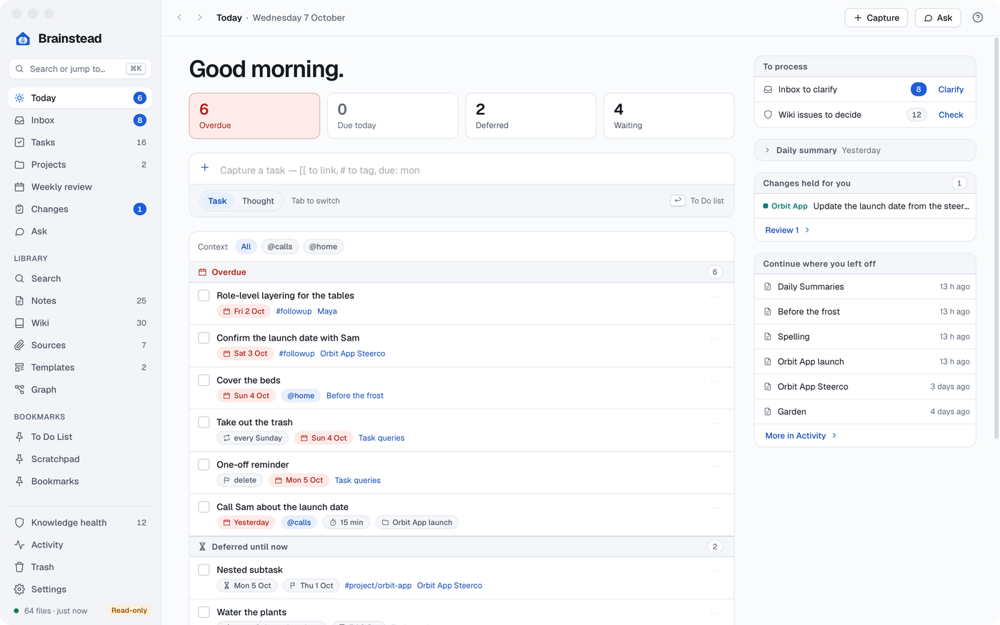

# Brainstead

A home for everything on your mind: tasks, notes and a wiki that writes itself, over a folder of plain markdown.

Brainstead is a Mac app for [Getting Things Done](https://gettingthingsdone.com), notes and a wiki, all in one folder of markdown files (your vault) that other markdown editors can open too. Your tasks are `- [ ]` lines in your notes, gathered into GTD lists. AI assistants you already have on your Mac (Claude Code, Codex, Copilot, Antigravity) answer from the vault, build wiki pages from your sources with every claim quoted, and make changes for you, each listed with Revert.

## Download

For a Mac with Apple silicon (M1 or later) and macOS 14 or later.

1. Download [Brainstead.dmg](https://github.com/waynetd777/brainstead/releases/latest/download/Brainstead.dmg) from the [latest release](https://github.com/waynetd777/brainstead/releases/latest).
2. Open it and drag **Brainstead** onto **Applications**.
3. Open Brainstead from Applications. macOS says it can't check the app for malicious software, because it isn't notarised by Apple. Click **Done**.
4. Open System Settings › Privacy & Security, scroll down and click **Open Anyway** beside Brainstead, then **Open Anyway** again and enter your password.
5. The first screen asks for Full Disk Access. A vault in a cloud-synced folder (OneDrive, iCloud Drive, Dropbox) needs it, or macOS asks for each folder; you can skip it. Then choose your vault folder, or click **Create a new vault** for a new one with a few example notes to try things on.

Brainstead opens a vault you choose read-only (a new one it makes for you opens writable). When you're ready for it to change files (ticking tasks, saving notes), turn off **Read-only** in Settings › Vault. See [First run](docs/features.md#first-run). To build it yourself instead, see [Building it](#building-it).

<a href="docs/images/index.md#the-readme"><picture><source media="(prefers-color-scheme: dark)" srcset="docs/images/today-dark.png"></picture></a>

## What it does

- **Today and [GTD](https://gettingthingsdone.com).** Today shows what's overdue, due and waiting. Quick capture (⌃⌥Space) works from any app. The Inbox, Tasks, Projects and a guided weekly review do the rest. [Tasks and GTD](docs/tasks.md)
- **Notes.** Read in View, write in Edit or Source. Wikilinks, tags, callouts, maths, diagrams, Tasks queries, Dataview and Templater all work. Saving never reformats what you didn't change, and won't overwrite a file changed elsewhere. [Notes](docs/notes.md)
- **A wiki built from your sources.** Ingest emails, Teams chats, PDFs, Office files and images, and the assistant writes wiki pages with every claim quoted from its source. Brainstead checks each quote. [The wiki and sources](docs/wiki.md)
- **Ask.** Chat with your assistant about your vault, or let it drive Brainstead from Terminal. It can do almost anything you can do in the app. Every change is listed in Changes, where you can revert it. [Ask and assistants](docs/ask.md)
- **Day to day.** A menu-bar icon, scheduled daily and weekly summaries, a daily check of the wiki, and help on every screen (`?`). [Day to day](docs/day-to-day.md)

[Features](docs/features.md) has the first run, the window and the keys.

## Licence

Brainstead is free software under the [GNU General Public License](LICENSE), version 3 or later: you may use, share and change it, and anything you pass on must stay free under the same licence. See [Licence and credits](docs/features.md#licence-and-credits).

## Building it

Needs Rust, Node.js and Xcode's command-line tools.

```sh
npm install
make dev          # run it with hot reload
make install-app  # build it and put it in /Applications
```

[Development](docs/development.md) has the rest: signing, the checks, the MCP server, evals, screenshots and where things live.
