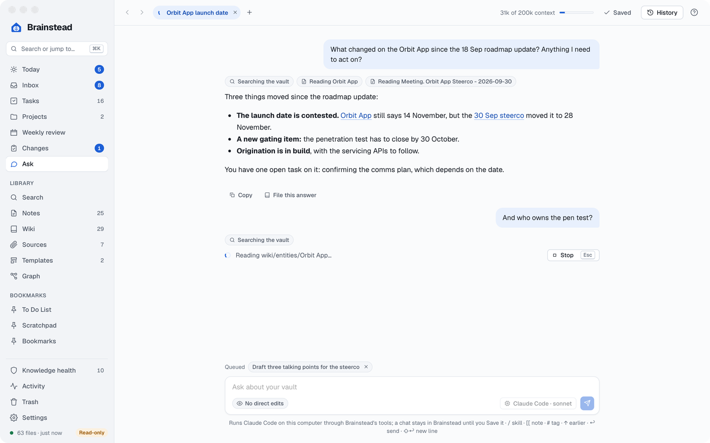
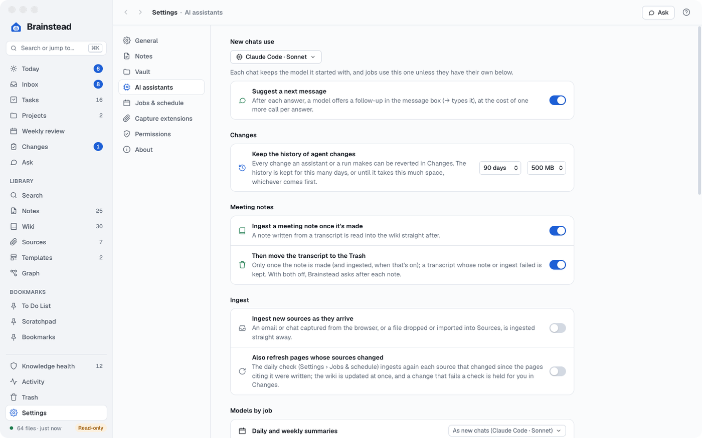

# Ask and assistants

Ask chats with the AI assistants already on your Mac, Claude Code, Codex, Copilot and Antigravity, signed in with your own accounts, inside your vault.

[Ask](#ask) · [What an assistant can do](#what-an-assistant-can-do) · [Sessions outside the app](#sessions-outside-the-app) · [Questions about Brainstead](#questions-about-brainstead)

## Ask

<a href="images/index.md#ask-and-assistants"><picture><source media="(prefers-color-scheme: dark)" srcset="images/ask-dark.png"></picture></a>

Most screens have an **Ask** button beside `?` that starts a chat about what you're looking at: the selected task, project, Inbox item, change or page, or else the screen itself (its tooltip says which), with the question begun for you to finish.

Ask (⌥⌘7) keeps each chat in a tab (⌘T for a new one). A chat stays in Brainstead's app data until you click **Save**, which puts it in the vault as `Chat. <title>.md` and keeps that note up to date from then on; background runs' chats stay out of the vault the same way. **History** finds, renames, pins, saves or moves old ones to the Trash; closed chats that aren't saved or pinned are deleted once 20 newer ones are in History. Pick the assistant and model before the first message. New chats start with the model set in Settings › AI assistants, where each background job can have its own model too.

- An empty chat offers example questions and Brainstead's skills to click, or says **No assistant found** and what to install.
- Keys: ↩ sends, ⇧↩ adds a line, ↑ and ↓ recall earlier messages, and Esc (or **Stop**) stops an answer.
- Messages sent while it answers queue up (a cross takes one out). A dot on a tab marks an answer you haven't seen (the sidebar's Ask badge counts them across the open tabs), and with Claude Code a meter shows how full the chat's context is.
- `/` lists workflows: Brainstead's `/wiki` answers from the vault with citations, with any assistant. The vault's own Claude Code skills are listed too.
- `[[` links a note and `#` a tag.
- After each answer the box offers a next message in grey; → types it in. **Suggest a next message**, under **New chats use** in Settings › AI assistants, turns it off, and **Models by job** picks its model.
- Under an answer: **Copy**, **File this answer** (as a new wiki page), **Add tasks**, **Update the wiki**, **Save as note** and **Ask another model**.

## What an assistant can do

The assistant never edits a file itself. Claude Code, Codex and Copilot get Brainstead's tools, which ask the app to do what its screens do. So ⌘Z, `log.md` and the rest work just as if you'd done it yourself.

**At once, undoable with ⌘Z** (the app says an assistant made the change):

- The Weekly review's prepared suggestions: accept or skip one (a suggested link is made as a change in Changes instead). Find tasks and projects' suggestions (`suggestions`): accepting one makes it as a change in Changes, with Revert, which ⌘Z undoes too, as Found's **Undo** does. Save an Ask chat to the vault (`save_chat`, by its file or title): an open one as Save does, a closed one as History's Save does. The Weekly review's Finish and save. Bookmarks, saved searches (refused, as **Save search** is, for a query saved already; `layers` are notes, wiki and sources, as Search's filters), restoring from the Trash (under another path too), adding files to Sources (`import_sources`), Knowledge health's safe fixes and the buttons an issue has of its own (`health_issue`: Create, Not duplicates, an unused image to the Trash), and [Fix name](wiki.md#meeting-notes-and-the-other-tools) (its preview lists each file as the screen does, with Rewrite, Add as alias, Left alone or Guarded and how many will change; in every file it would change, or only those given, as ticking them does; with `files_to_leave_alone`, `ask_about_each_file` (**Ask about each file**: the notes to rewrite start unticked, so only those given in `files` are rewritten), `where_its_from`, and `remember` on unless false, as on the screen).

**At once, with no ⌘Z** (only when you ask, and never in a session nobody is watching for the first two):

- The Weekly review's **Start over** (`weekly_start_over`): its progress, notes and handled suggestions are dropped; what it changed in the vault stays. As starting the review on the screen, it prepares the week's suggestions when the week has none.
- Moving over (`moving_over`): `tick` and `untick` the items you tick yourself, and **Retire them** (`retire`), refused until **The other app is stopped** is ticked, as on the screen: the previous app's skills and scripts go to the Trash, to restore from there. `list_moving_over` reads the checklist.
- How long Changes keeps its history (`changes` with `history`), a setting you change back in Settings › AI assistants.
- Settings › Vault's **Rebuild index** (`rebuild_index`): every file is read again; the files aren't changed.
- Your tools that start Claude Code sessions (`automated_tools`, with `folder_contains` and `first_message_starts_with`, the screen's **Folder contains** and **First message starts with**), listed in Settings › Jobs & schedule.
- Knowledge health's Ignore and Show again (`ignore_issue`), for issues with no fix.
- A Contradictions report saved as a note (`contradictions` `save`) waits, as the screen's button does, until no check is running.
- Going through the Weekly review (`weekly_step`: start, next step, notes), marking a contradiction resolved or ignored (`contradictions`), Ask's chats (`chats`: rename, pin or unpin, move to the Trash), Tasks' saved lists (`task_lists`) and settings (`settings`, all but the vault, Read-only and the folders left out: Open at login, the models for new chats and for each job, the spelling language (by its name, British English), the quick capture shortcut (checked, and said whether macOS registered it), a note's Text size, the read-aloud voice and speed, the document look and whether documents are light or dark among them; **Only in the menu bar when the window is closed** is refused while **Show in the menu bar** is off, as the screen shows it only then), and a note's own look (`note_look`: its Theme and Colour, its **Use the defaults**, and Settings › Notes' **Use the defaults for all**; `list_note_looks` reads them), which is kept in Brainstead's settings by the note's path, not in the note.
- Runs: an ingest (images too), the daily or weekly summary, the weekly review's preparation (for a paused review, its own week, as the screen's Prepare again), the daily check, Find tasks and projects, a contradictions check, a meeting note from a transcript, Knowledge health's Write Current state (`write_current_state`), with their progress and Stop (an ingest or meeting note waiting its turn too, as Stop on its row). What a run changes in the vault is listed in Changes, with Revert: `run_status` lists the last eight summary runs as Settings › Jobs & schedule does, each with the id of its change, so `changes revert` undoes one as Recent runs' **Undo** does, and its chat with the model (Open), as the weekly review's preparation gives its own; it also lists the meeting notes lately finished or failed, and what the checks left out of an ingest or a meeting note. Bookmark triage (its suggestions named as Triage's choices: Keep, Ingest into the wiki, Make a task, Archive, Remove; acting on one is the button's own steps, Make a task being `capture` to the Inbox, and Ingest and Make a task then taking the bookmark off, as on the screen), a drafted reply (`tone` `brief`, the default, `warm` or `formal`) and a doc check, as their screens do (its findings and the register in the screen's words: Conflict, Not covered, In force…). A meeting note's `type` is one of the screen's: Meeting, 1-1, Workshop or Interview; its name and date are built as the screen builds them, from what's given over what was read from the transcript, and, as **Draft the note**, it's refused without a name and a YYYY-MM-DD date (neither today nor the transcript's topic stands in), when its note exists already (unless the name or date is changed) or when one is being drafted. An ingest is refused on a wiki page or a template, as the file menu offers no Ingest on them. A doc check against the version in force with no `governing_document` takes the register's first, as the screen's picker starts with.

**Made at once, listed in Changes with Revert**: tasks (tick, untick, their words as the Tasks screen's rename changes them (`words`), dates, priority, contexts, effort, project, waiting for, follow-up (`followup`), cancel, reorder (`move_task`, within one list as dragging does: between its neighbours there, or the list renumbered when some of it has no rank yet; with `project`, a project's Next actions, as dragging on its page does), add (with its due, defer and start dates, as `edit_task` names them; to the To Do list's Other section, the Inbox, unless a project is given; with `view` `followups`, `waiting` or `someday`, that list's tag, as New task there does), delete), Quick capture (`capture`: a task to the Inbox, a thought to the Scratchpad, with the capture box's shorthand), clarifying an Inbox item (its edits to two notes made or held together; waiting for in a project goes under the project's Waiting for, as the screen files it), projects (create; status, area and Done looks like, in the screen's names: a Completed project is `completed`, the page's **Mark complete**, written `status: done` in its note), a change to any page (`edit_page`), a new note (named `Type. Title - date`, or made from one of your templates, its folder and date checked the same way either way, which `test_run` only shows, as the template editor's Test run does; `answers` gives a list for a question with several choices, and `null` (or `""` for one with choices) is the screen's Cancel; the other notes a template makes, `tp.file.create_new`, are made or held with it, and its `tp.hooks` finishing steps run once the note is made, as after New note), a new wiki page, a rename (the file keeps its own extension, as the file menu's Rename does; with `preview`, only the links it would rewrite, as the Rename box lists them), Settings › Vault's Add the example notes (`add_example_notes`, refused when they're all there), Doc check's Save as note and Start the register (`doc_check` with `save` or `start_register`), a move to the Trash, Knowledge health's Reshape pages (`reshape_pages`, one run to revert together) and Link to… (`health_issue`), a saved Contradictions report, a new template (`create_template`, always held). A quote not found in its source is flagged, once. A change to a template, one that adds code that runs, one that changes a [system note's header](notes.md#system-notes), and a rename or trash of a template (or a rename whose link rewrites touch one) is held for you. A session nobody is watching passes `unattended`, and its changes that fail a check are held too, as are those of the runs it starts. An assistant can list changes (`list_changes`), and reject a held one or revert one (`changes`) when you ask it to; it accepts a held change only in a session you're in, and only one held for a failed check (decided 2026-10-05, D-20261005-09). Accepting a held meeting note offers its follow-up in the app (ingest it, move the transcript to the Trash), as accepting it on the Changes screen does, and tells the assistant so.

**What it can read**: search (in Search's `order`: `best_match`, `latest` or `oldest`; `since` is the date menu, adding `since:` to the query, so it goes by the note's own date), any page or section, backlinks, which page a name means, the facts ingest kept for each wiki page (`facts`), your tasks by list (with the Tasks screen's effort filter, Group by and search: `list_tasks` with `effort`, `group` and `query`, which matches as **Search tasks** does, in the task's note, heading, project, tags and contexts too, accents ignored; each with its #tags, priority, status and created date, and `today` in the Today screen's bands, Waiting for among them), the Inbox (with `suggest`, the model's suggestion for each of the first 20 items, as **Suggest** gives it; accepting one is `clarify_inbox` with its values), projects (each active one flagged `stuck` or `quiet`, as the Projects screen's Stuck and Quiet), the daily and weekly summaries, the Weekly review's progress and suggestions, Changes, runs, transcripts (with `show` `all`, the done ones too, as the screen's Show › All; each with the note that exists already, what to check, and whether a note is being drafted or was drafted), the Trash, Activity (by action and words, as its chips and search filter it, in its `order`, Best match or Latest; with `date`, the day picked: its files changed and its entries), the links around a page, Sources with their status (`pending_sources`: New, Changed or Ingested, as the Sources screen gives it; New and Changed unless `status` says; a file an ingest can't read is left out, and `start_run ingest` refuses it, as the screens offer no Ingest on it), Knowledge health's report (`lint`, as the screen shows it while the app is open, starting with its summary card: Need a decision, what's safe to fix and the trend), a source's Provenance card (`provenance`: ingested by which run, what the index holds of it, and the wiki pages citing it with the passages they quote) and its Page shape check (`page_shape`), the contradictions found (with the judge's fix and whether it's waiting in Changes), Ask's chats, the settings, Moving over's checklist (`list_moving_over`), Settings › Capture extensions (`capture_extensions`), Glance's counts (`glance`), whether the app is running (`app_status`: the index's counts or why it failed, as Settings › Vault shows it, Full Disk Access, the version and the app data folder), the links around a page (`graph`, the page by its name or link, two links away unless asked, and saying when it kept only the nearest 400 pages, as the screen does), and the in-app help. `list_contradictions` gives the screen's banners too: why the last check failed, and the fixes it couldn't make.

Each read is a tool of its own, marked read-only, beside the tool that changes the same thing: `list_changes`, `list_chats`, `list_trash` (and `restore_from_trash`), `list_bookmarks`, `list_saved_searches` (each search's layers too, so running it matches the screen), `list_contradictions`, `list_suggestions`, `list_automated_tools`, `list_task_lists`, `list_settings`, `list_note_looks`, `list_moving_over` and `list_assistants` (Settings › AI assistants' **Found on this computer**, with its **Look again**, then each assistant's command to use Brainstead's tools from Terminal and **Skills Brainstead does now**). So an assistant can be let read without asking you. `list_bookmarks` also says which bookmarks Triage would flag (untouched for two weeks), so bookmark triage (`triage_bookmarks`) is only the model's suggestions on the ones given.

Every tool that lists something, tasks included, says how many there are and gives a page at a time (`limit`, `offset`, and `query` to keep rows with all those words). Changes is one list, the held changes first and then those made, newest first, paged as a whole. The main lists also give their rows as data the assistant can read field by field, and `search`, `list_projects`, `list_changes`, `activity` and `graph` give a short line a row unless the assistant asks for `detail`. A call with arguments a tool can't take is answered with what's wrong, so the assistant can try again. Nothing changes while the vault is read-only. Antigravity takes no outside tools in the mode Ask runs it, so it reads with its own tools only.

## Sessions outside the app

<a href="images/index.md#ask-and-assistants"><picture><source media="(prefers-color-scheme: dark)" srcset="images/settings-assistants-dark.png"></picture></a>

The same tools work from an assistant in Terminal, in every folder. Settings › AI assistants shows each assistant's command to copy; run it once:

```sh
claude mcp add -s user brainstead -- "/Applications/Brainstead.app/Contents/MacOS/Brainstead" --mcp   # Claude Code
codex mcp add brainstead -- "/Applications/Brainstead.app/Contents/MacOS/Brainstead" --mcp            # Codex
copilot mcp add brainstead -- "/Applications/Brainstead.app/Contents/MacOS/Brainstead" --mcp          # GitHub Copilot
agy mcp add brainstead -- "/Applications/Brainstead.app/Contents/MacOS/Brainstead" --mcp              # Antigravity
```

Searching and reading the vault, facts, the summaries, the health report, the Page shape check and help work with Brainstead closed. Everything else needs the app, and opens it. `open` brings the window to the front on a screen (by its sidebar name), a Settings pane, a note (with lines highlighted, when given), a search, or Meeting note from a transcript, Draft a reply or Check a document on the transcript, thread or document to work on; Graph with a page opens around that page.

What you're typing and haven't saved (a note's unsaved edits, a draft in a box) stays with the screen: no tool reads or changes it. So do Changes' **Edit before accepting** (it opens the page with the change as an unsaved draft for you to edit), and the file menu's **Export PDF…**, **Copy markdown**, **Copy rich text**, **Copy path**, **Copy title** and **Reveal in Finder**, which go to a save dialog, your clipboard or Finder rather than the vault; an assistant reads the note itself instead. So do the Trash's **Empty the Trash** and **Delete forever**, which can't be undone: an assistant can move things to the Trash and restore them, but no tool deletes them for good (D-20261007-10).

## Questions about Brainstead

Ask how to do something in Brainstead ("how do I change the capture shortcut?") and the assistant answers from the app's own help, naming where things are, rather than from your vault. The help is the same as the `?` drawer on every screen.
