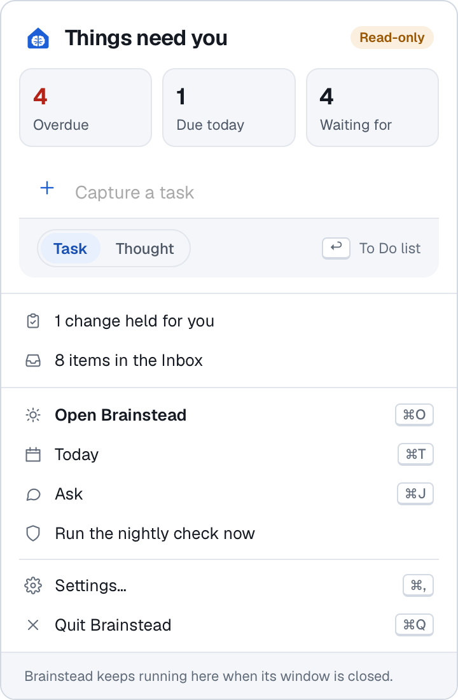
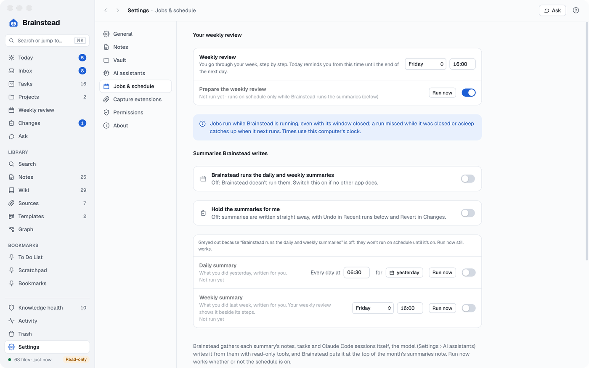
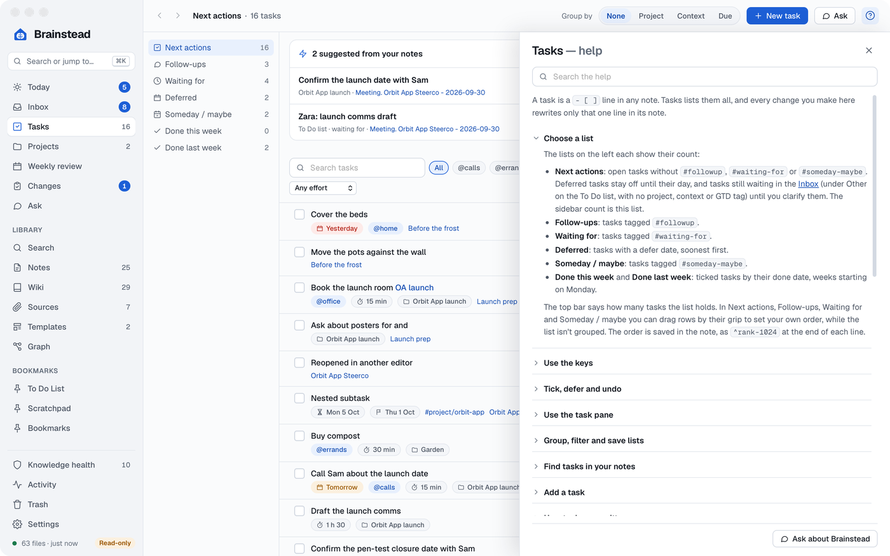
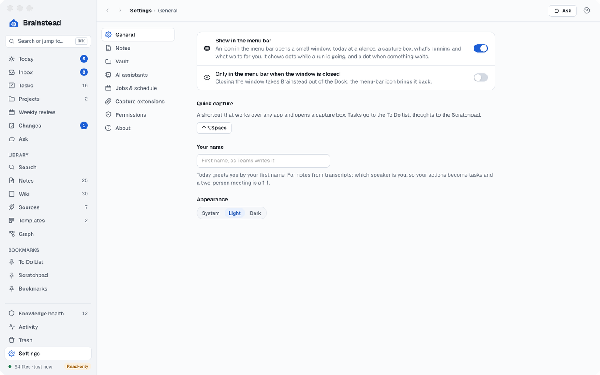

# Day to day

Brainstead keeps working while its window is closed: Quick capture, captures from the browser, the daily and weekly summaries and the daily check all run from the menu bar.

[The menu bar](#the-menu-bar) · [Summaries and jobs](#summaries-and-jobs) · [Help](#help) · [Settings](#settings) · [In the background](#in-the-background)

## The menu bar

<a href="images/index.md#day-to-day"><picture><source media="(prefers-color-scheme: dark)" srcset="images/tray-dark.png"></picture></a>

Brainstead's icon in the menu bar shows three dots while a run is going, and a dot when something waits for you: a task overdue, changes held for you or items in the Inbox. Click it for:

- A headline summing it up (**All clear**, **Things need you**, runs going, or what couldn't load), with a **Read-only** pill while the vault is read-only that opens Settings › Vault, and **Overdue**, **Due today** and **Waiting for** counts that open Today.
- A capture box, the same as Quick capture.
- Each run that's going, with its progress and **Stop**.
- Changes held for you and items in the Inbox, each opening its screen.
- **Open Brainstead** (⌘O), **Today** (⌘T), **Ask** (⌘J), **Run the daily check now**, **Settings…** (⌘,) and **Quit Brainstead** (⌘Q).

With **Open at login** (in Settings › General or the menu-bar window) and **Only in the menu bar when the window is closed** on in Settings › General, Brainstead starts when you log in and lives in the menu bar, out of the Dock until you open its window.

## Summaries and jobs

<a href="images/index.md#day-to-day"><picture><source media="(prefers-color-scheme: dark)" srcset="images/settings-jobs-dark.png"></picture></a>

In Settings › Jobs & schedule:

- **Daily summary** and **Weekly summary**: Brainstead gathers the day's or week's notes, tasks and Claude Code sessions, and a model writes the summary from them. A note with a day in its name, such as a meeting note, counts on that day, however late it was written up. **Run now** can write a past day's summary again (pick the day in **for**). (The weekly summary isn't the Weekly review screen, which you go through yourself.) Brainstead puts it at the top of the month's summaries note, undoable, or holds it for you in Changes first (**Hold the summaries for me**). Each runs as a chat in Ask, in a tab marked with a calendar.
- **Prepare the weekly review**: on the review day, 4 hours before the review, a model reads the week and suggests actions for each step of the [weekly review](tasks.md); nothing changes until you accept one. It has its own switch, Run now and Stop, and runs on schedule only while Brainstead runs the summaries.
- To use them, turn on **Brainstead runs the daily and weekly summaries**, and switch them off in any other app that writes them.
- **Daily check**: contradictions in the wiki pages that changed, the list of pages in `index.md` brought up to date, and a count of the wiki pages edited out of the page shape (for Knowledge health's Reshape pages); optionally re-ingesting sources that changed (a switch under Ingest in Settings › AI assistants).
- **Recent runs**, with **Open**, **Show** and **Undo**; the Daily, Weekly and Daily check rows have **Stop** while one runs.

The summaries split what you did into **Work done** and **Personal** by your projects' areas: a project with the area Personal is personal, any other area is work, done projects included. Brainstead lists the projects and their areas in the summary's inputs and marks each Claude Code session whose folder is named after a project (letters and digits compared, so `orbit-app` is Orbit App).

A run missed while the Mac slept catches up when Brainstead next runs. To keep sessions started by your own tools (a script, another app) out of the daily summary, list them under **Your tools that start Claude Code sessions** in Settings › Jobs & schedule: each is a name, and the folder its sessions run in, the words their first message starts with, or both. Their sessions are then counted as automated instead of as your work. **Add a tool** adds one by hand, and folders whose recent sessions look like a tool's are offered to add in one click. Assistants list them with the `list_automated_tools` tool, and add and remove them with `automated_tools`.

The ingest switches (ingest new sources as they arrive, refresh pages whose sources changed) are together under **Ingest** in Settings › AI assistants, below how long Changes keeps its history.

## Help

<a href="images/index.md#day-to-day"><picture><source media="(prefers-color-scheme: dark)" srcset="images/help-dark.png"></picture></a>

Press `?` on any screen, click the ? button on the top bar, or choose Help › Brainstead Help (⇧⌘?), for that screen's help in a drawer on the right. Type to search every topic. **Getting started** has six guides you step through, each linking to the screen it's about: Start here, Capture and write, Build the wiki, Find, GTD and Knowledge health. **Ask about Brainstead** puts a question to Ask, which [answers from the same help](ask.md#questions-about-brainstead). The keyboard shortcuts are in Help › Keyboard Shortcuts and in ⌘K.

## Settings

<a href="images/index.md#day-to-day"><picture><source media="(prefers-color-scheme: dark)" srcset="images/settings-general-dark.png"></picture></a>

Settings (⌘,) has General, Notes, Vault, AI assistants, Jobs & schedule, Capture extensions, Permissions and About; press `?` on each for what's in it.

## In the background

- **The index.** Brainstead indexes the vault in a database outside it, so search, tasks and lists are instant, and follows changes made in other apps as they happen.
- **Safe writes.** Every write is atomic, keeps each file's line endings, and refuses if the file changed since it was read. Files that aren't UTF-8 open read-only.
- **Drafts.** Unsaved text is kept as a draft a second after you stop typing, and offered back after a crash.
- **Undo.** ⌘Z undoes the app's last changes (a tick, a date, a clarified item, an assistant's change, a rename), up to five back, even after a restart; in a note, ⌘Z undoes your typing as usual.
- **`log.md` and Activity.** Brainstead records what it changes in the vault's `log.md`. **Activity** shows it under a heatmap of files changed by day, with pie charts of your notes by type and by tag and the most linked notes and pages beside it; a slice opens the notes it counts.
- **The vault is yours.** Nothing about Brainstead is kept in the vault except what you'd expect there: notes, tasks, chats, the wiki and `log.md`. Settings, the index, drafts and the remembered name corrections live in `~/Library/Application Support/Brainstead/`.
