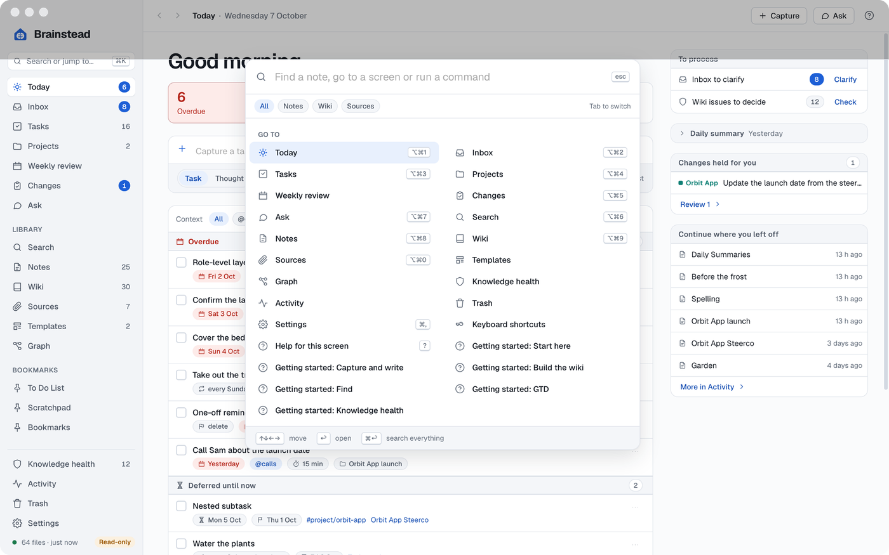

# Features

The user guide to Brainstead, a Mac app for tasks, notes and a wiki over one folder of plain markdown files, your vault. Each screen's help (`?`) goes deeper.

<a href="images/index.md#features"><picture><source media="(prefers-color-scheme: dark)" srcset="images/today-dark.png"></picture></a>

| Page | What's in it |
|---|---|
| [Tasks and GTD](tasks.md) | Today, Quick capture, the Inbox, Tasks, Projects, the weekly review, and how tasks are written |
| [Notes](notes.md) | View, Edit and Source, saving and drafts, queries and callouts, templates, search and ⌘K, the Trash |
| [The wiki and sources](wiki.md) | Sources and the browser extensions, ingest, Changes, wiki pages, Knowledge health, contradictions, meeting notes and the other tools |
| [Ask and assistants](ask.md) | Chats with Claude Code, Codex, Copilot and Antigravity, what an assistant can do, Brainstead's tools in Terminal |
| [Day to day](day-to-day.md) | The menu bar, the daily and weekly summaries and the daily check, help, Settings, and what happens in the background |

## Requirements

A Mac with Apple silicon (M1 or later) and macOS 14 or later. Ask and the AI features need at least one of Claude Code, Codex, GitHub Copilot's CLI or Antigravity installed and signed in; everything else works without them. The capture extensions need Chrome, Edge, Brave, Vivaldi or Chromium.

## First run

The Welcome screen says what Brainstead is and asks for two things:

- **Full Disk Access.** A vault in a cloud-synced folder (OneDrive, iCloud Drive, Dropbox) needs it, or macOS asks separately for each protected place. **Open System Settings**, turn Brainstead on under Privacy & Security › Full Disk Access, and let macOS reopen it. You can skip it and come back from Settings › Permissions.
- **Your vault**: the folder of markdown notes. Brainstead opens it **read-only**, so nothing changes until you turn **Read-only** off in Settings › Vault. No vault yet? **Create a new vault** asks for a name and where to put it, and makes it with a few example notes (a To Do list, a project, a meeting note, a template, wiki pages and sources), each saying it's an example you can delete; **Start here** lists them. A new vault opens with Read-only off, as nothing in it is yours yet. Settings › Vault › **Add the example notes** puts back any that are missing.

Notifications are asked for the first time Brainstead has something to tell you.

Moving over from another notes app? When that app's files are in the vault, the checklist of that name, at the top of Settings › General, lists what's left: the vault made writable, the daily and weekly summaries running here, captures arriving from the browser extensions, your own automated sessions listed, the other app's reviews, extensions and app switched off, and its skills and scripts retired: moved to the Trash, with the vault's `CLAUDE.md` telling agents to use Brainstead's tools, so their changes show in Changes.

## The window

<a href="images/index.md#features"><picture><source media="(prefers-color-scheme: dark)" srcset="images/palette-dark.png"></picture></a>

The sidebar has **Today**, **Inbox**, **Tasks**, **Projects**, **Weekly review**, **Changes** and **Ask**, then the library (**Search**, **Notes**, **Wiki**, **Sources**, **Templates**, **Graph**), your **Bookmarks**, and at the foot **Knowledge health**, **Activity**, **Trash** and **Settings**, and whether the index is up to date. Counts that want attention, such as the Inbox and changes held for you, are filled badges.

| Keys | What they do |
|---|---|
| ⌘K | Search or jump to anything, and run commands |
| ⌘⇧F | The Search page |
| ⌃⌥Space | Quick capture, from any app |
| ⌘N | New note |
| ⇧⌘P | Read the open note aloud, then play or pause |
| ⌥⌘1 … ⌥⌘9, ⌥⌘0 | Today, Inbox, Tasks, Projects, Changes, Search, Ask, Notes, Wiki, Sources |
| ⌘[ ⌘] | Back, forward |
| ⌘Z | Undo the last change |
| ⌘, | Settings |
| ? | Help for this screen |

Every screen remembers its choices (the list, the filter, the selection) across restarts, and back and forward go through where you've been. Closing the window leaves Brainstead running in the [menu bar](day-to-day.md#the-menu-bar); ⌘Q quits, asking first about unsaved edits.

## Licence and credits

Brainstead is free software under the GNU General Public License, version 3 or later.

- You may use it, share it and change it.
- Anything you pass on, changed or not, must stay free under the same licence, with its source.
- It comes with no warranty.
- The licence is in `LICENSE` in the source, and at [gnu.org](https://www.gnu.org/licenses/gpl-3.0.html).

Brainstead is built with Tauri and React. Its editor is CodeMirror, its markdown is rendered with unified (remark and rehype), maths with KaTeX, diagrams with Mermaid, PDFs with pdf.js and the graph with d3-force; recurring tasks use rrule, and dates moment, Luxon and chrono-node. The index is SQLite with FTS5 (through rusqlite), and diffs come from the `similar` crate. These are under the MIT, Apache 2.0, BSD or ISC licences. The type is Geist and Geist Mono, under the SIL Open Font License.
