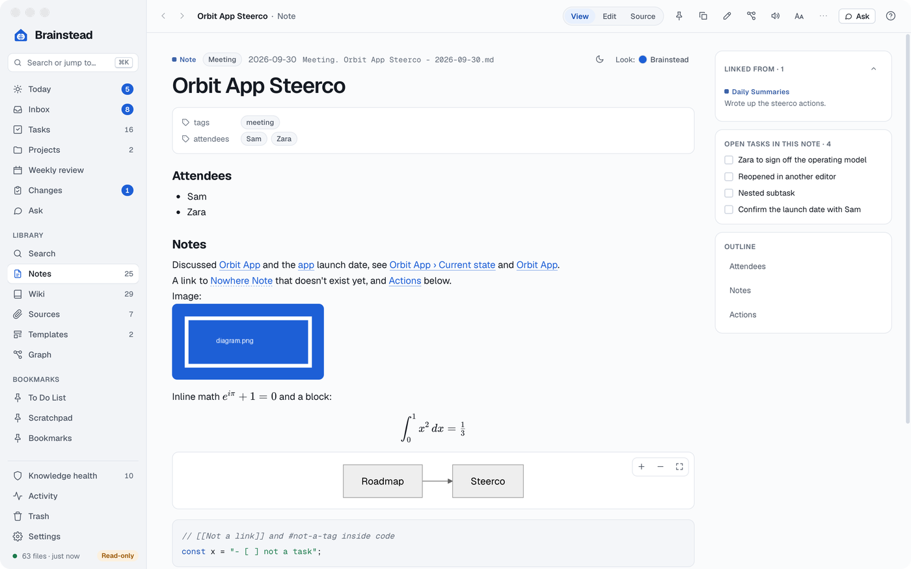
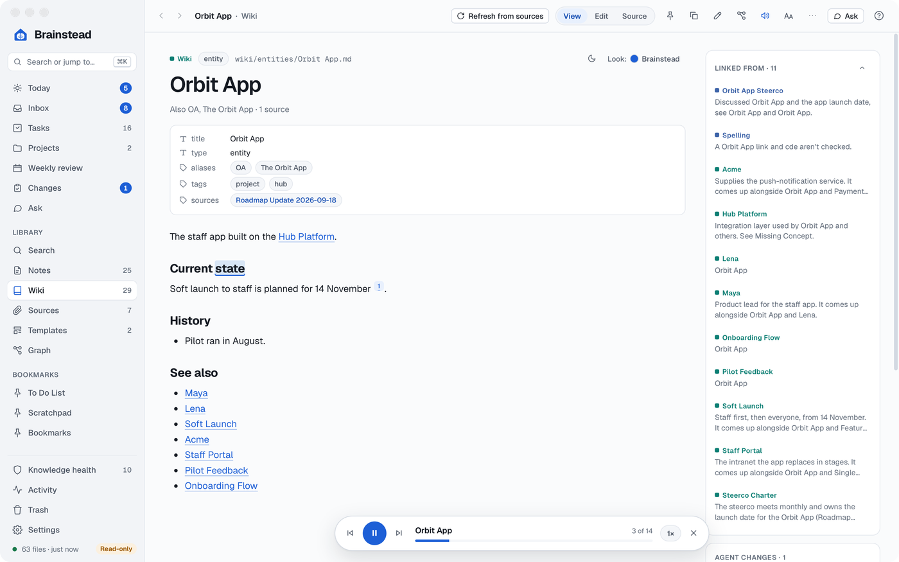
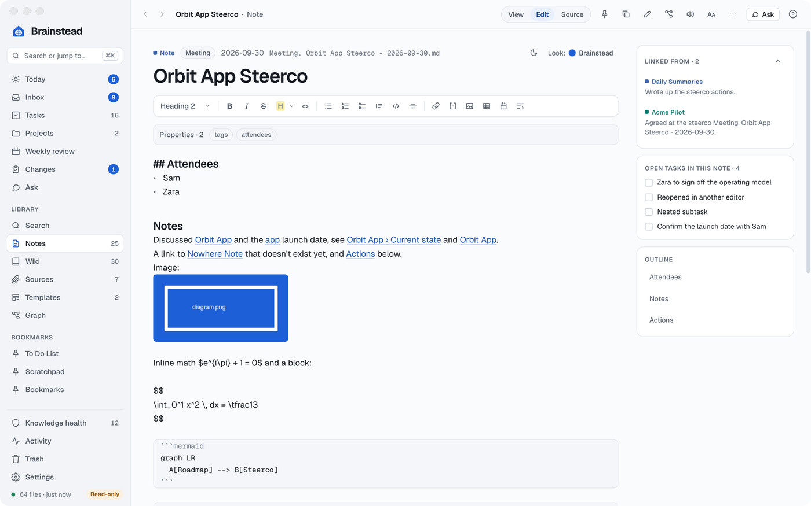
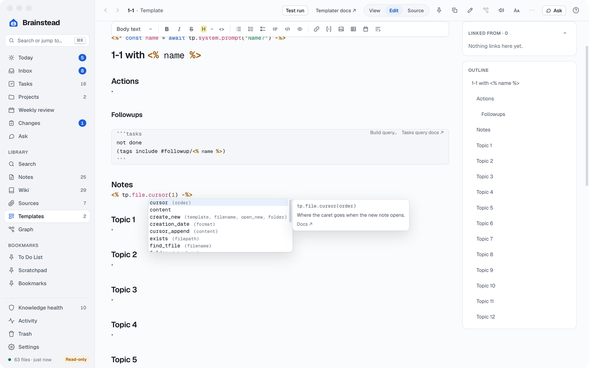
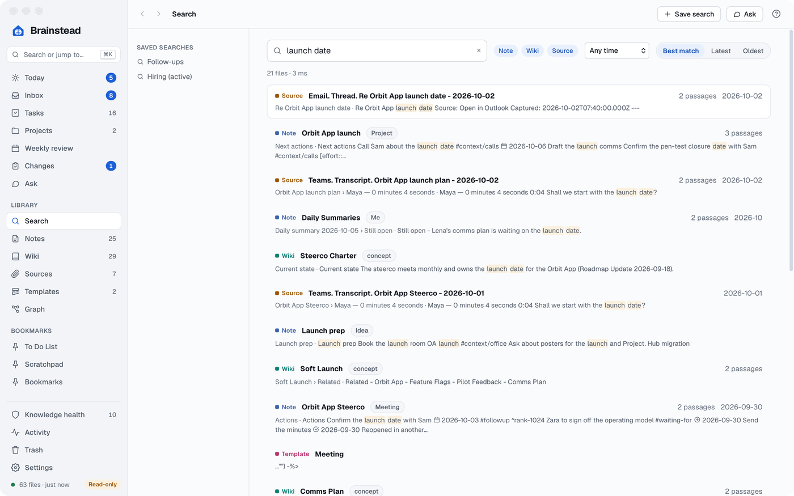

# Notes

[A note](#a-note) · [Read aloud](#read-aloud) · [Writing](#writing) · [Saving and drafts](#saving-and-drafts) · [Queries, callouts and diagrams](#queries-callouts-and-diagrams) · [Templates](#templates) · [Finding things](#finding-things) · [System notes](#system-notes) · [The Trash](#the-trash)

## A note

<a href="images/index.md#notes"><picture><source media="(prefers-color-scheme: dark)" srcset="images/note-dark.png"></picture></a>

A note opens in **View** (⌘1), rendered: properties, links, tables, tasks, callouts, diagrams and maths. **Edit** (⌘2) is the markdown with its syntax hidden away from the lines you're on; **Source** (⌘3) is the plain markdown in a monospaced font, with no formatting and no toolbar. Beside the note are **Linked from** (every note that links here, with the line), its **open tasks** to tick, and its **outline**. On a 1-1 note, **Last time with** and the person's name shows the previous 1-1 and the follow-ups still open with them.

The top bar has **Ask** (a chat about the note, source or template), a bookmark, **Copy** (markdown, rich text, path or title), **Rename…** (⇧⌘R, with every link to the note rewritten), **Graph** and more; the **Note** menu in the menu bar has most of them. **Export PDF…** (⌘P) writes the note in its look with page numbers. Each note can have its own look (Brainstead, Business, Editorial, Modern, Minimal, Report or Technical) and colour, and documents can be light or dark on their own.

## Read aloud

<a href="images/index.md#notes"><picture><source media="(prefers-color-scheme: dark)" srcset="images/read-aloud-dark.png"></picture></a>

Click the speaker on the top bar, or press ⇧⌘P, and Brainstead reads the note or wiki page aloud in macOS's voices, highlighting each word as it's said. Space plays and pauses, and Esc stops. Choose the voice and speed in Settings › Notes; the note's help (`?`) has the rest.

## Writing

<a href="images/index.md#notes"><picture><source media="(prefers-color-scheme: dark)" srcset="images/editor-dark.png"></picture></a>

- The toolbar formats text, lists, tasks, quotes, code, tables, links and images, and inserts today's date or a query.
- `[[` links a note and `#` adds a tag, both suggested from the vault as you type part of a name (`[[` alone lists your newest notes, and `#calls` finds `#context/calls`); ⌘-click a link to open it.
- Paste or drop an image and it's saved in `images/` and embedded.
- In a task, `due:`, `defer:`, `start:` and `created:` followed by a word (tomorrow, fri, +3d) become dates; a date picker opens as soon as you type the colon.
- Spelling and grammar are checked as you type, in the English you choose.
- ⌘F finds, and in Edit and Source replaces, one match or all.

**New note** (⌘N) names the note from its type, title and date, as `Meeting. Orbit App Steerco - 2026-09-30.md`, or makes it from a template.

## Saving and drafts

⌘S saves. Unsaved text is kept as a draft a second after you stop typing, so nothing is lost if the app quits; opening the note again offers it back. Leaving a note with unsaved changes asks first. If another app changed the file meanwhile, a change on other lines is merged in; a change on the same lines shows a banner with **Reload**, **Keep mine** and **Compare**, which marks the lines that differ. Nothing is overwritten.

## Queries, callouts and diagrams

- **Tasks queries** (`tasks` blocks) and **Dataview** (`dataview` blocks: TABLE, LIST, TASK and CALENDAR) run in View, with tasks you can tick. In Edit, the editor suggests what comes next in a block, and **Build query…** opens a builder with a live preview.
- **Callouts** (`> [!tip] Title`) are drawn as tinted boxes with an icon, folding with `[!tip]-` or `[!tip]+`.
- **Mermaid** diagrams (with pan and zoom), **KaTeX** maths (`$…$` and `$$…$$`; an amount like $5 isn't taken for maths), highlighted code and `==highlights==` in colours.

Plain queries work in every note. Scripts in queries (`dataviewjs` blocks, inline `$=` and Tasks' `filter by function`) run only in your own notes: not in sources, wiki pages, templates, saved chats, the summary notes or notes an assistant wrote. A note an assistant wrote carries `created-by: assistant`; delete that property to trust it.

## Templates

A template turns a routine into one click. A 1-1 template can ask who it's with, file the note under their name and date, and pull in every open follow-up you've tagged for them. A weekly plan can lay out the days ahead and list what's due in each. Templates are short scripts in Templater's syntax, and Brainstead helps you write them: inside a `<% %>` tag the editor suggests what can go there as you type, `tp` and its functions with their arguments, dates through `moment`, and your own names, each explained with a link to its docs. Hover over a name, in Edit or in View, to see what it does. **Test run** shows what the template would make before you use it.

<a href="images/index.md#notes"><picture><source media="(prefers-color-scheme: dark)" srcset="images/template-caret-dark.png"></picture></a>

Templates are the files in `Templates/`, written in Templater's syntax: prompts and pick lists, dates, file names, properties, includes and your own scripts in `Templates/scripts`. A template runs in the app when you make a note from it, asking its questions in the New note dialog. **Test run** shows what a template would make without writing anything.

A new vault comes with example templates that each show a few of these: Meeting, Daily note (date offsets and an include), 1-1 (a pick list and a `#followup` task), Project, Weekly plan (a loop and a user script) and Reading note (properties and a move to a folder). **Settings › Vault › Add the example notes** adds any that are missing.

## Finding things

<a href="images/index.md#notes"><picture><source media="(prefers-color-scheme: dark)" srcset="images/search-dark.png"></picture></a>

- **⌘K** opens a box over any screen: notes, wiki pages and sources, open tasks, screens and commands, **Search everything**, **Ask** and **Capture … as a task**.
- **Search** (⌘⇧F) searches every note, wiki page and source's text. Words match in any form; `+word`, `-word`, `"exact phrase"`, `tag:hiring`, `since:2026-09` and `before:2026-10-01` narrow it. Choose the layers, a date range and the order; **Save search** keeps one for later.
- **Notes**, **Wiki** and **Sources** list their files, filtered as you type, and sorted; Notes can also be grouped by type.

## System notes

Some notes are Brainstead's own lists: the To Do list, the Scratchpad, bookmarks, saved searches, the canonical docs register, the daily and weekly summaries' notes, `CLAUDE.md`, `index.md` and `log.md`, and any note that opens with a **This is a system note** callout. Other features look for them, so:

- They can't be renamed or moved to the Trash, from the app or by an assistant; the file menu greys those items.
- The header callout is locked in the editor, with a lock that says why. Edit freely below it.
- If the header goes missing or changes, Knowledge health flags it, and its safe fix puts back the last header Brainstead saw.
- An assistant's change to the header is always held for you in Changes, and only you can accept it.

Other apps can still change these files.

## The Trash

Moving a note to the Trash puts it in the vault's `.trash` folder, with Undo. The Trash screen lists what's there, searches it, puts files back where they were, and deletes them for good.
