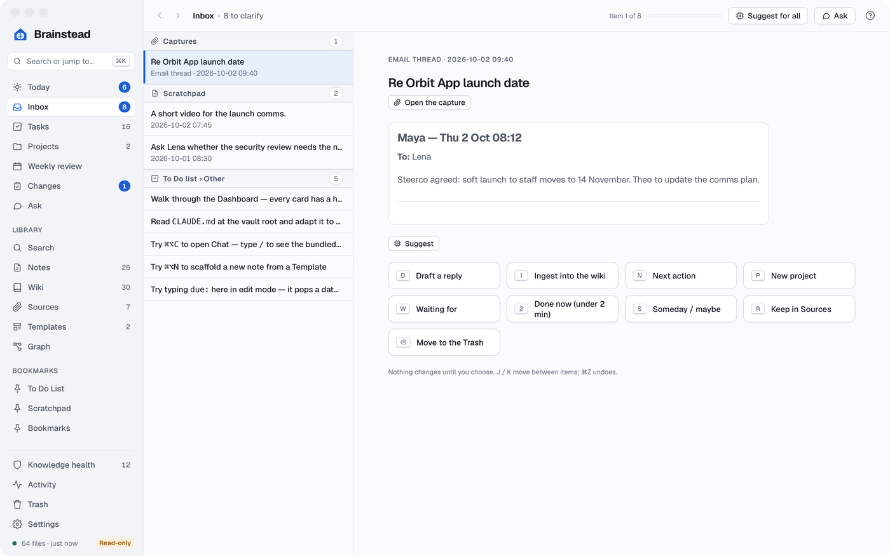
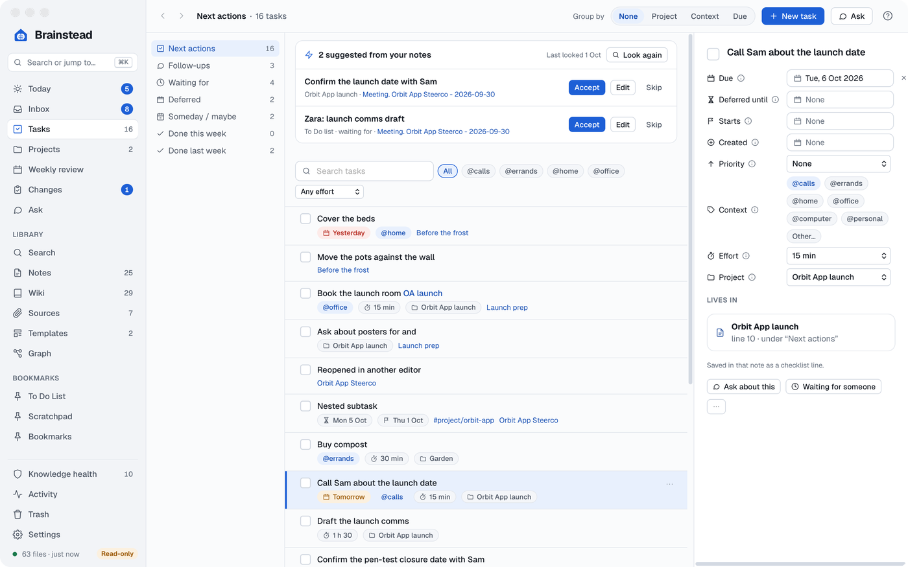
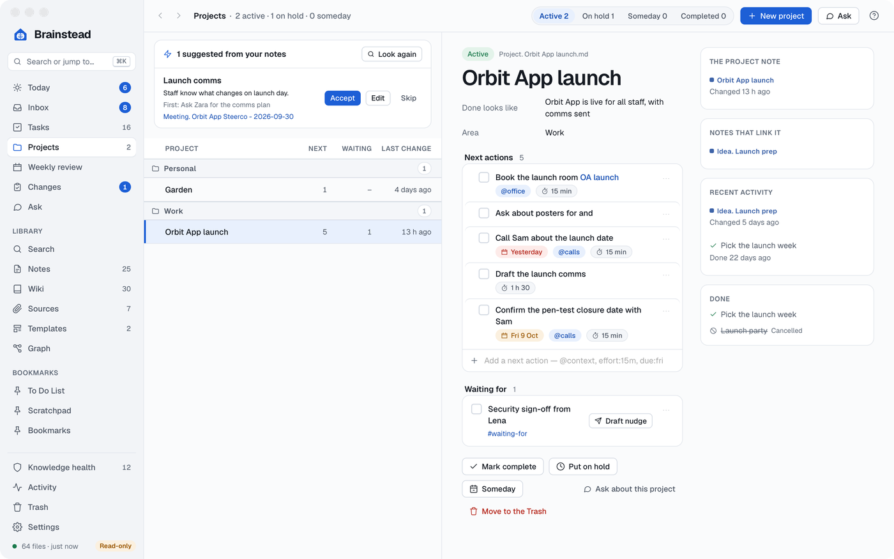
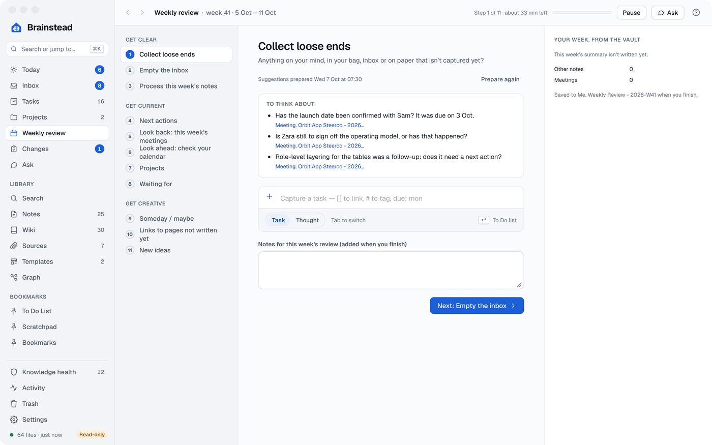

# Tasks and GTD

Brainstead runs [Getting Things Done](https://gettingthingsdone.com) (GTD) over the tasks already in your notes. A task is a `- [ ]` line in any note; Brainstead gathers them into lists, and every change you make rewrites only that one line, so other markdown editors see the same task.

[Today](#today) · [Quick capture](#quick-capture) · [The Inbox](#the-inbox) · [Tasks](#tasks) · [Projects](#projects) · [The weekly review](#the-weekly-review) · [How tasks are written](#how-tasks-are-written)

## Today

<a href="images/index.md#tasks-and-gtd"><picture><source media="(prefers-color-scheme: dark)" srcset="images/today-dark.png"></picture></a>

Today (⌥⌘1) is what needs you now:

- One table with a band each for **Overdue**, **Due today**, **Deferred** (until now) and **Waiting**, with a count above that jumps to each band. A task deferred to a later day stays off Today until then, even when it's due or overdue. Waiting-for rows show how many days they've waited. Tick, date and change tasks in place; ⌘Z undoes.
- `@context` chips (and **All**) to show only the tasks in one context, Waiting for included.
- A capture box, the same as Quick capture.
- **To process**: the Inbox to clarify, bookmarks to triage, wiki issues to decide, and the weekly review on its day.
- **Weekly summary** and **Daily summary**: the most recent of each, folded to a line with its date and the next run until you open it. **Open note** goes to its heading.
- **Changes held for you**, from the scheduled runs, and **Continue where you left off**: unsaved drafts first, then notes opened and changed lately.

A waiting-for row has **Draft nudge**, which drafts a short follow-up with Ask to copy into Outlook or Teams. Nothing is sent.

## Quick capture

Press ⌃⌥Space in any app (change it in Settings › General). Type a task and press ↩: it goes on the To Do list under Other. Press Tab for a **Thought**, which goes to the Scratchpad under a date and time heading. As you type, `due: fri`, `defer: +3d`, `@calls` and `effort:15m` become the task format, `[[` links a note and `#` adds a tag. Both kinds wait in the Inbox.

## The Inbox

<a href="images/index.md#tasks-and-gtd"><picture><source media="(prefers-color-scheme: dark)" srcset="images/inbox-dark.png"></picture></a>

The Inbox (⌥⌘2) lists what you've captured but not yet decided: emails and Teams chats from the browser extensions, Scratchpad thoughts, and tasks under Other on the To Do list. Pick one (`J` and `K` move) and choose what it becomes:

| Key | Choice |
|---|---|
| `N` | Next action, with its project, context, effort and due date |
| `P` | A new project |
| `W` | Waiting for |
| `2` | Done now (under 2 min) |
| `S` | Someday / maybe |
| `R` | File as reference in a note |
| `⌫` | Delete |

A captured email or chat can also be ingested into the wiki (`I`), made into a meeting note (`M`) or answered with a drafted reply (`D`). **Suggest for all** suggests a choice for the first 20 items; ↩ accepts one. ⌘Z undoes each choice.

## Tasks

<a href="images/index.md#tasks-and-gtd"><picture><source media="(prefers-color-scheme: dark)" srcset="images/task-pane-dark.png"></picture></a>

Tasks (⌥⌘3) has the GTD lists: **Next actions**, **Follow-ups**, **Waiting for**, **Deferred**, **Someday / maybe**, and **Done this week** and **last week**. Next actions leaves out deferred tasks until their day, and Inbox tasks (under Other on the To Do list, with no project, context or GTD tag) until you clarify them.

- Tick to finish a task (a recurring one gets its next occurrence). ⌘Z undoes.
- The ⋯ menu or a right-click sets due and defer dates, priority, context, effort and project, marks it in progress or waiting for, cancels or reopens, deletes or opens its note.
- Click a task for the pane on the right, which edits all of these in place and shows the note and heading it lives in.
- Drag rows into your own order; it's kept in the file as `^rank-N`.
- Keys: `↑` `↓` choose a task, `↩` opens it, `Space` ticks, `⌫` deletes (⌘Z puts it back), `/` searches; they work on Today, Projects and the weekly review too.
- **Search tasks** narrows every list to the tasks matching all its words (in the task, its note, heading, project, tags or context); the counts on the left follow it.
- Group by **Project**, **Context** or **Due**, filter by context and effort, and **Save this list…** for a view you use often.
- **New task** adds one to the To Do list, with the list's tag and the chosen context so it shows where you are (`#waiting-for` in Waiting for, say). From a list with neither, it waits in the Inbox.
- **Find tasks and projects**, at the top of Next actions and of the active Projects, has an assistant read your notes from the last 90 days for things you meant to do that aren't tasks yet, and pieces of work your notes keep returning to that aren't projects. Each suggestion quotes its note (Brainstead checks the quote is there), and **Accept**, **Edit** or **Skip** decides it; an accepted one is listed in Changes with Revert, and neither comes back. It only runs when you start it, there or from ⌘K.

## Projects

<a href="images/index.md#tasks-and-gtd"><picture><source media="(prefers-color-scheme: dark)" srcset="images/projects-dark.png"></picture></a>

A project is a note named `Project. <name>.md`, with its status, area and outcome as properties. Its tasks are the ones written in it plus any that link it. Projects (⌥⌘4) lists them by status and area. An active project is flagged **Stuck** (red) when it has no next action, and **Quiet** (amber) when nothing has moved for two weeks. There you can add next actions, edit the outcome and area, change the status, and draft nudges for what you're waiting for. **New project** writes the note with its headings.

## The weekly review

<a href="images/index.md#tasks-and-gtd"><picture><source media="(prefers-color-scheme: dark)" srcset="images/weekly-dark.png"></picture></a>

The weekly review walks you through GTD's three phases, Get clear, Get current and Get creative, in eleven steps over your real lists. You empty the Inbox, then go through next actions, projects that are stuck, what you're waiting for, someday / maybe and missing wiki pages, acting on each as you go. **Pause** keeps your place; **Finish and save** writes your review into the week's own note, `Me. Weekly Review - YYYY-Www.md` in the vault's top folder (finishing the same week again rewrites it, keeping anything under its **Added later** heading; ⌘Z undoes it). Open it from **Weekly review** in the sidebar, under Projects, which shows a start page first: the week it's for, when it's scheduled, how its suggestions stand, and **Start the review** (or **Carry on** and **Start over** for a paused one); opening that page prepares nothing. Today also shows **Start** from the review's day and time (Settings › Jobs & schedule, Friday 16:00 by default) until the end of the next day. A review covers the week the weekly summary would: on a Monday or Tuesday the week just ended, otherwise this week; a paused one keeps its own week. It isn't the scheduled weekly summary (Settings › Jobs & schedule), which an AI writes into the week's block in the month's weekly summaries note and which reads your review note when it's there. Reviews finished in older versions are a `### Your review` section in that block instead; the summary keeps them when it runs again.

With an AI assistant set up, the review is prepared from your week: each step shows suggestions above its lists, such as a task to add from a meeting, one to tick, defer or reword, an Inbox item to clarify or a link to make, each with its action and **Skip**. Nothing changes until you click; an accepted one is the app's usual undoable action, and a link is made too, listed in Changes with Revert. What you accept or skip is kept with your progress. Starting the review prepares them if the scheduled run hasn't; **Prepare again** reads the week afresh.

## How tasks are written

Tasks follow the widely used Tasks format, so other markdown editors read them:

```markdown
- [ ] Call Sam about the launch date #context/calls [effort:: 15m] 📅 2026-10-06 ^rank-2048
- [ ] Security sign-off from Lena #waiting-for ➕ 2026-09-30
- [x] Send the steerco pack ✅ 2026-10-02
```

`📅` is due, `⏳` deferred until, `🛫` start, `➕` created and `✅` done. A deferred task stays off Next actions until its day; a start date doesn't hide the task, it only makes it less urgent until then. A context is a `#context/<name>` tag and effort a `[effort:: …]` field. `#followup`, `#waiting-for` and `#someday-maybe` put a task on those lists. A task belongs to a project when it's in the project's note or links it. Tasks inside quotes and callouts (`> - [ ] …`) count too. The app shows dates and fields as icons and chips, never the emoji.
