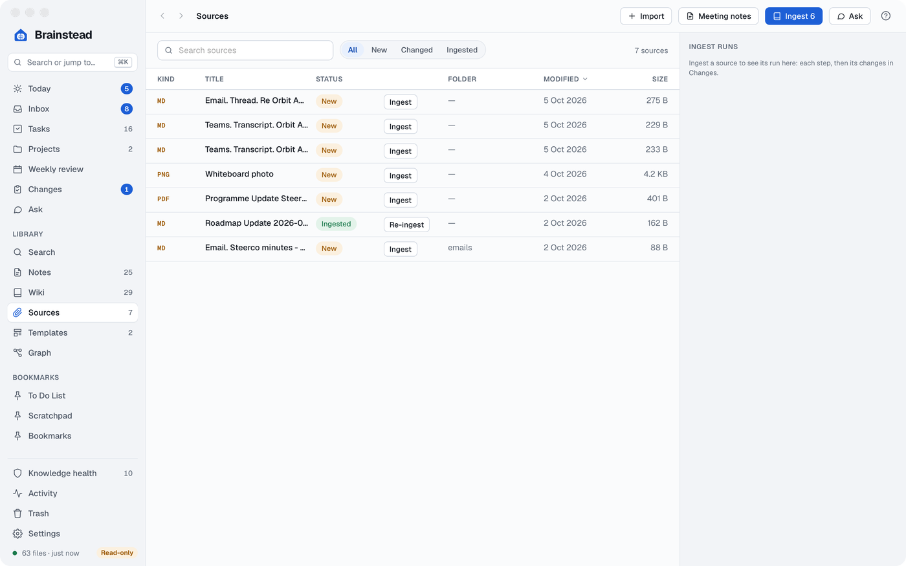
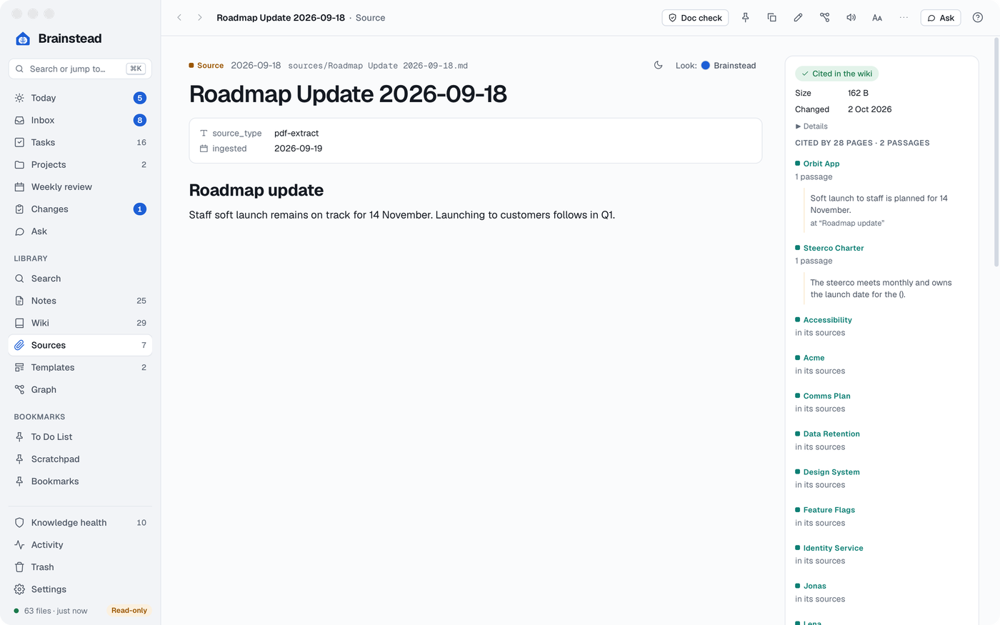
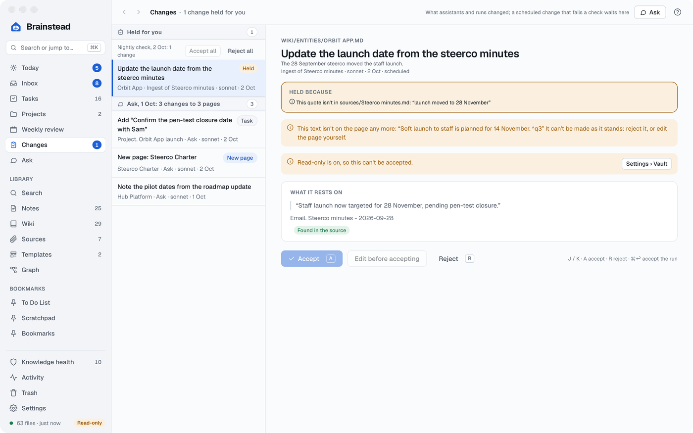
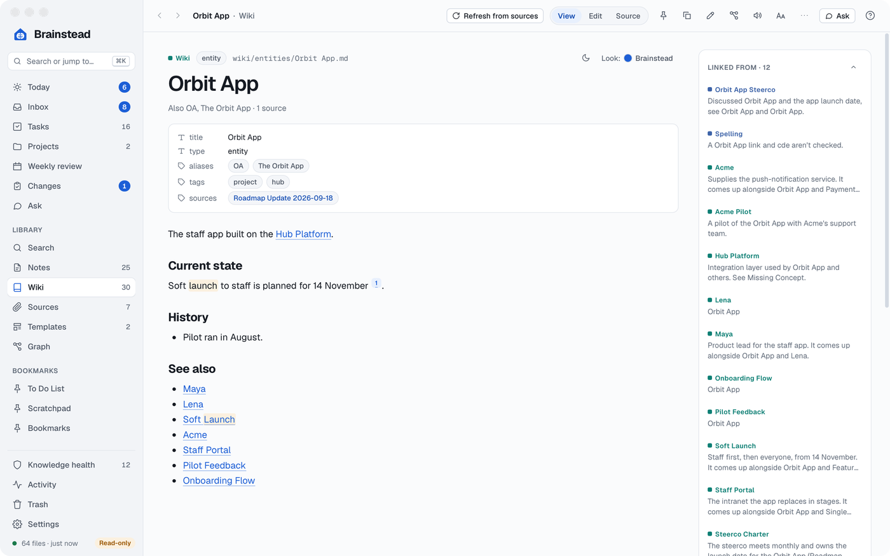
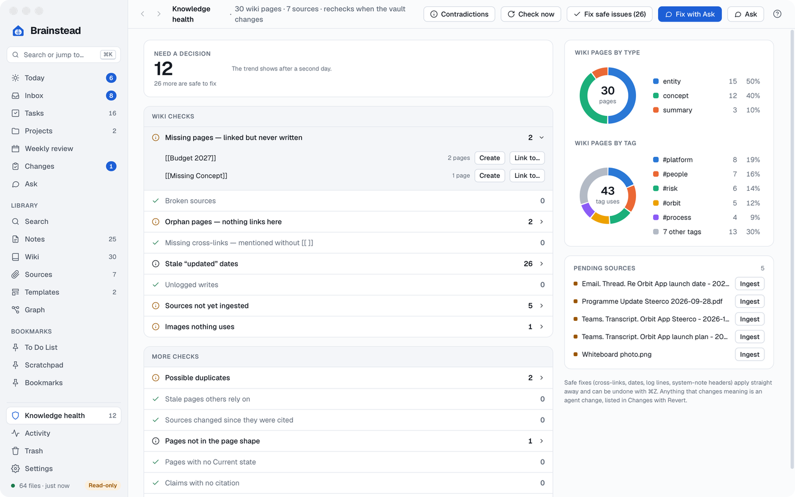
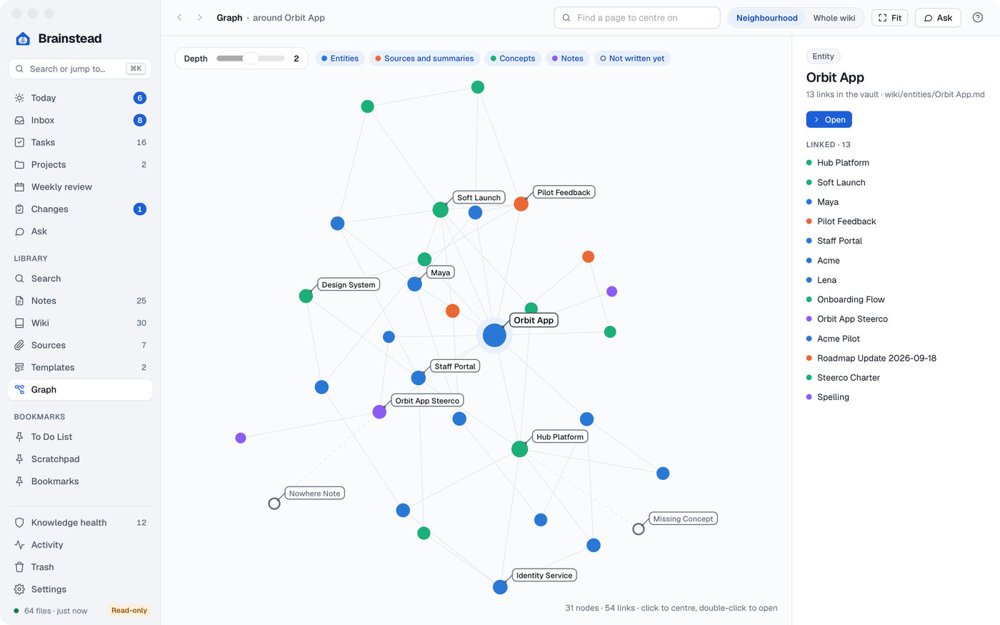

# The wiki and sources

Brainstead keeps a wiki in your vault's `wiki/` folder: a page per person, team, product or idea, built from your sources, with every claim quoted from where it came from. The AI writes the pages; every quote is checked against its source, and each change is made at once and listed in Changes, with Revert.

It follows Andrej Karpathy's [LLM Wiki](https://gist.github.com/karpathy/442a6bf555914893e9891c11519de94f) pattern: raw material in `sources/`, pages the model maintains in `wiki/`, a catalogue in `index.md` and a record in `log.md`. Brainstead adds quotes checked against their sources, Changes (every AI change, with Revert), Knowledge health and a contradictions check.

[Sources](#sources) · [Ingest](#ingest) · [Changes](#changes) · [Wiki pages](#wiki-pages) · [Knowledge health](#knowledge-health) · [Contradictions](#contradictions) · [Graph](#graph) · [Meeting notes and the other tools](#meeting-notes-and-the-other-tools)

## Sources

<a href="images/index.md#the-wiki-and-sources"><picture><source media="(prefers-color-scheme: dark)" srcset="images/sources-dark.png"></picture></a>

Sources (⌥⌘0) are the files in `sources/`: emails and Teams chats and transcripts captured from the browser, PDFs, Word, PowerPoint and Excel files, images, and notes. They are the record, so Brainstead doesn't edit them, except to correct misheard names (a change you can revert).

- Drag files onto Sources, or click **Import**, to copy them in.
- The **Outlook** and **Teams** Chrome extensions capture a thread, a chat or a meeting transcript into `sources/` with one click. Set them up in Settings › Capture extensions; each capture also waits in the Inbox.
- Each source is **New**, **Changed** (since the pages citing it were written) or **Ingested**.
- A PDF opens with page navigation, zoom and find; Word, PowerPoint and Excel show the text Brainstead reads from them (slide by slide, sheet by sheet), with **Quick Look** (`Space`) for how they look in their app; an image with the text read from it (macOS's text recognition), which search uses too.

<a href="images/index.md#the-wiki-and-sources"><picture><source media="(prefers-color-scheme: dark)" srcset="images/source-provenance-dark.png"></picture></a>

Beside a source, its provenance says when it was ingested and by which model, and which wiki pages cite it, with the passages they cite.

## Ingest

**Ingest** reads a source and has the AI draft changes to the wiki pages it mentions, each claim with a quote from the source. Brainstead checks every quote: a change none of whose quotes it can find is dropped, and one with only some missing is kept and flagged. The changes are made and listed in Changes, and the source is added to each page's `sources:` list. If your notetaker misheard a name, ingest also fixes it in the source. A run shows its steps as it goes, with **Stop**.

Ingests wait in one queue, whoever started them (you, an assistant or the nightly check), and run one at a time, the oldest source first (by the date in its name, else the file's), so a newer source has the last word on a page.

The AI sees a long page as its outline, with its opening, its summing-up sections (such as Current state) and its newest sections in full, and never its `sources:` list. It updates a section it saw all of, or adds a new one: a Current state under the page's opening text, anything else above its See also; a change that would rewrite a section it saw only part of is dropped, so nothing it couldn't see is lost.

An image is ingested from the text read from it; Claude Code and Codex also see the picture, Copilot and Antigravity don't (so an image with no text needs one of the first two). Its changes are kept even when a quote isn't in that text, each flagged in Changes to check against the picture.

An ingest you start makes its changes at once (logged, and revertable in Changes). One the nightly check starts holds a change that fails a check (a quote not found, text read from an image) for you instead. **Ingest new sources as they arrive**, under Ingest in Settings › AI assistants, in the same group, ingests each capture as it lands.

## Changes

<a href="images/index.md#the-wiki-and-sources"><picture><source media="(prefers-color-scheme: dark)" srcset="images/review-dark.png"></picture></a>

Assistants and runs change the vault themselves, and Changes (⌥⌘5) lists every change they made, newest first, grouped by run ("Nightly check, 5 Oct: 6 changes to 4 pages"), each with its diff, why, who made it, the quotes it rests on and **Revert**. A change may come from Ask, a terminal session, an ingest, Knowledge health, a contradiction fix, the daily or weekly summary, or a meeting note.

- A change you started (Ask, a terminal, a run started by hand) is made at once, and flagged if a check fails.
- A scheduled run's change (the nightly check, its ingests and contradiction check, the scheduled summaries) is made when it passes every check, and held otherwise: a quote not found or resting on text read from an image, text rewritten or taken out of one of your own notes (anything outside `wiki/`, `sources/`, `index.md`, `log.md` and the summaries' notes), unsaved edits to the page, an open contradiction on it (one whose fix is applied in Changes no longer counts), or properties that wouldn't read.
- A change to a template, one that adds code that runs when a note is shown, or one that changes a [system note's header](notes.md#system-notes), is always held. Renames and moves to the Trash are made at once, unless they move a template or rewrite links in one. An assistant accepts a held change only while you're there, and only one held for a failed check.
- **Held for you** is at the top, each with why: **Accept** (`A`), **Reject** (`R`), **Edit before accepting**, and **Accept all** or **Reject all** for a run (`⌘↩` accepts the run). A held change keeps what was asked for, so it applies to the page as it is when you accept it. Only held changes are counted in the sidebar.
- **Revert** undoes a change on the page as it is now, keeping later edits. If its lines have been edited since, it says so and offers the page as it was before, to copy. **Revert all** does it for every change a run made. A page's side pane lists its agent changes, with Revert.
- History is kept 90 days or 500 MB, whichever comes first (Settings › AI assistants).

## Wiki pages

<a href="images/index.md#the-wiki-and-sources"><picture><source media="(prefers-color-scheme: dark)" srcset="images/wiki-page-dark.png"></picture></a>

Every entity and concept page has one layout: the opening text, **Current state**, topical sections, a **Timeline** of `### YYYY-MM-DD — title` entries (or `YYYY-MM`, `YYYY-Q3`, `YYYY-H1`) newest first, each with a `Source: [[…]]` line naming the note or source it came from, and **See also**. Summaries are left as they are.

The Wiki (⌥⌘9) lists the pages by type and tag with their health: **Held**, **Stale**, **Check** or **Healthy**. On a page, a link to a source shows as a small number that opens the source at the passage cited, listed in the **Sources** card. A banner says when another page disagrees. **New wiki page** makes an entity or concept page you write yourself.

## Knowledge health

<a href="images/index.md#the-wiki-and-sources"><picture><source media="(prefers-color-scheme: dark)" srcset="images/health-dark.png"></picture></a>

Knowledge health checks the wiki whenever the vault changes: missing pages and links, broken or changed sources, duplicates, stale pages and claims with no citation, among others.

- Pie charts on the right show the wiki's pages by type and by tag; a slice opens the Wiki filtered to it.
- **Fix safe issues** fixes the ones with one right answer (a missing link, a date, a `log.md` line), undoably.
- Missing pages can be created or linked to an existing page; duplicates compared or dismissed.
- **Pages not in the page shape** lists entity and concept pages laid out another way. **Reshape pages** reshapes those it can by itself, by script with no model: sections move whole, dated headings are rewritten to the ISO form, a dated summing-up heading becomes Current state with an "As of" line, entries from one source on one date merge, of several dated summing-up sections the newest is Current state, See also lists merge, and every result is checked (no line lost, the frontmatter untouched, reshaping it again changes nothing) before it's written. Each page is one change in Changes, in one run with Revert all. A page that needs you says why (a year it can't tell, two summing-up sections, two entries citing the same note on different dates); fix the heading, or **Reshape anyway**. Assistants use `page_shape` and `reshape_pages`.
- **Pages with no Current state** (not counted) lists pages with a Timeline but no Current state. **Write 5** and **Write all** have the cheap model (Haiku when Claude is the assistant) write one from the page's opening and newest Timeline entries only; an answer linking anything the page doesn't is turned down. Each page is a change in one run in Changes. Assistants use `write_current_state`.
- **Fix with Ask** hands the issues that need judgement to an assistant, whose fixes are made and listed in Changes.

## Contradictions

The contradictions check reads the claims on the pages that changed, groups claims about the same thing, and has the AI judge the ones whose values differ: **Real** (with its severity), **Newer supersedes older**, **Not a conflict** or **Unclear**. When the judge has a fix for a real one, it's made and listed in Changes. **Mark resolved**, **Ignore**, or **Save report as note**. The [nightly check](day-to-day.md#summaries-and-jobs) runs it on the pages that changed each day.

## Graph

<a href="images/index.md#the-wiki-and-sources"><picture><source media="(prefers-color-scheme: dark)" srcset="images/graph-dark.png"></picture></a>

The **Graph** draws how pages link: a page's neighbourhood, or the whole wiki. Each kind of page has the colour it has on the Wiki pages by type pie: entities blue, sources and summaries orange, concepts green, notes purple.

## Meeting notes and the other tools

- **Meeting notes** turns a Teams transcript into a meeting or 1-1 note from your template, with names spelt as your vault spells them; it's made in the vault (listed in Changes), then ingested, and the transcript moved to the Trash (both on by default, in Settings › AI assistants; a transcript whose note or ingest failed is kept). **Meeting note** on a transcript's row in Sources, `M` in the Inbox or **Make a meeting note** on its right-click menu does all of that in one step when Brainstead is sure of the note's type, name and date, and opens Meeting notes at the question when it isn't. Tick several there and **Draft all** does each the same way, with one message at the end. The note is dated with the meeting's day, which the Teams extension reads from the recap page; when it couldn't, the date is the capture day and you confirm it first.
- **Fix name** corrects a misspelt name across every note and wiki page at once (sources are left alone), adds the wrong spelling as an alias, and remembers the correction for future ingests. One ⌘Z undoes it all.
- **Draft reply** drafts an answer to an email or Teams thread, drawing on the vault, for you to copy and send.
- **Triage bookmarks** goes through your bookmarked notes with a suggestion for each: keep, update or drop.
- **Doc check** checks a document against the version in force of the document it should follow, or whether a revision took in your feedback. Which version is in force comes from your register of governing documents, the note `Me. Canonical Docs.md`, which Doc check can start for you.
