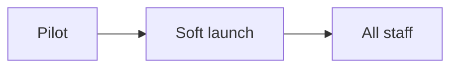

> [!example] Example meeting note
> Meeting notes are named `Meeting. <name> - <date>`. Delete this one when you're done.

## Attendees

- Maya
- Lena

## Notes

We agreed the plan for the [[Orbit App]] launch and how it fits the [[Project. Orbit App launch|project]].

## Actions

- [ ] Send the kick-off notes to Acme #followup 📅 {{date+1}}
- [ ] Lena to confirm the security review #waiting-for
- [x] Book the kick-off room ✅ {{date-1}}
