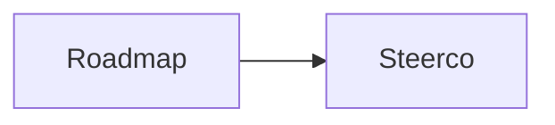

## Attendees
- Sam
- Zara

## Notes
Discussed [[Orbit App]] and the [[OA|app]] launch date, see [[Orbit App#Current state]] and [[Orbit App#^q3]].
A link to [[Nowhere Note]] that doesn't exist yet, and [[#Actions]] below.
Image:
![[diagram.png]]

Inline math $e^{i\pi} + 1 = 0$ and a block:

$$
\int_0^1 x^2 \, dx = \tfrac13
$$



```js
// [[Not a link]] and #not-a-tag inside code
const x = "- [ ] not a task";
```
Code span `[[Also not a link]]` and `#nottag`.

## Actions
- [ ] Confirm the launch date with Sam 📅 2026-10-03 #followup ^rank-1024
- [ ] Zara to sign off the operating model #waiting-for ➕ 2026-09-30
- [x] Send the minutes ✅ 2026-09-30
- [ ] Reopened in another editor ✅ 2026-09-29 ^rank-2048
	- [ ] Nested subtask ⏳ 2026-10-05 🛫 2026-10-01 #project/orbit-app
